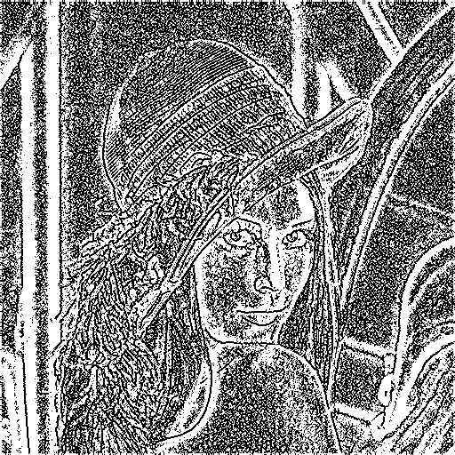

# pyOpticalPUF
pyOpticalPUF is a python library designed to help facilitate the analysis of optical physically unclonable functions (OPUFs). This library contains several fingerprinting algorithms, useful metrics and utility functions to make analysis easier.

## Fingerprinting
Currently local binary patterns (LBP), adaptive high boost (AHB), Otsu and Sauvola are the supported fingerprinting algorithms. The parameters for each of these algorithms are accessible within a companion object designed to facilitate ease of use and minimization of errors.

### Fingerprinting Example 
``` python
from pyOpticalPUF import LBP, LBPParameters
import cv2
params = LBPParameters(radius = 2, neighbours = 8, keySize = (512, 512))
lenna = cv2.imread("Examples/Lenna_(test_image).png", cv2.IMREAD_GRAYSCALE)
fingerprint = LBP.calculateFingerprint(lenna, parameters = params)
cv2.imshow("Lenna", lenna)
cv2.imshow("Leena-print", fingerprint)
cv2.waitKey()
```
which displays
Lenna | Lenna-print
:----:|:------------:
.png) | 

## Displays
This library comes with a few built in displays to aid with visualisation and interpretation. 

__Display example here__


## Metrics
...

## NIST
...

## Utility
...

## References
Ella Mann-Andrews, Thomas McGrath, Blake Halliday, Robert James Young; A guide for assessing optically imaged physically unclonable functions for authentication. Appl. Phys. Rev. 1 June 2025; 12 (2): 021314. https://doi.org/10.1063/5.0253691